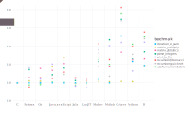

[Julia](http://julialang.org)是一个为数值计算设计的高性能的高级动态语言。Julia提供了一个复杂精巧的编译器，[分布式](http://docs.julialang.org/en/stable/manual/parallel-computing/)的并行计算环境，精确地数值计算以及一个可扩展的[数学函数库](https://docs.julialang.org/en/latest/#Standard-Library-1)。Julia的基础库大部分由纯Julia语言编写，但是也集成了在特定领域（如[线性代数](http://docs.julialang.org/en/stable/stdlib/linalg/)，[随机数生成](http://docs.julialang.org/en/stable/stdlib/numbers/#random-numbers)，[信号处理](http://docs.julialang.org/en/stable/stdlib/math/#signal-processing)和[字符串处理](http://docs.julialang.org/en/stable/stdlib/strings/#strings)）很多成熟的库。此外，Julia开发者社区也不断地通过Julia自带的包管理器在贡献大量的[包（package）](http://pkg.julialang.org)。此外，由[Jupyter](http://jupyter.org)和Julia社区共同努力的成果[IJulia](https://github.com/JuliaLang/IJulia.jl)，使得你可以在笔记本（notebook）界面里使用Julia。

<!--
This keynote talk by Stefan Karpinski at [ODSC Boston](https://www.odsc.com/boston) (2016) on [the two language problem](https://www.youtube.com/watch?v=B9moDuSYzGo) explains much of the motivation behind Julia:

<iframe width="560" height="315" src="https://www.youtube.com/embed/B9moDuSYzGo" frameborder="0" allowfullscreen></iframe>

-->

Julia程序使用一种基于多重派发的编程范式，通过对不同类型的组合（类型可以是用户自定义的）定义和[重载]((https://en.wikipedia.org/wiki/Function_overloading))函数来进行组织。对于在不同系统上使用Julia的好处的深度讨论可以在下面的部分或者是[介绍](http://docs.julialang.org/en/stable/manual/introduction/)和[在线指南](http://docs.julialang.org)中找到。

# Julia语言的特性

* [多重派发](http://en.wikipedia.org/wiki/Multiple_dispatch)：提供了为多重类型的**组合**定义函数的能力
* 动态类型系统：为文档，优化和分发而定义的类型系统
* 内建的包管理器
* [Lisp一样的宏](http://docs.julialang.org/en/stable/manual/metaprogramming/#macros)和其它[元编程工具](http://docs.julialang.org/en/stable/manual/metaprogramming/)
* 调用Python：Julia可以通过[PyCall](https://github.com/stevengj/PyCall.jl)直接调用Python的函数
* [调用C](http://docs.julialang.org/en/stable/manual/calling-c-and-fortran-code/)：Julia可以简单地（无需额外对特殊API的封装）调用C代码
* 像shell一样强大的[管理其它进程的能力](http://docs.julialang.org/en/stable/manual/running-external-programs/)
* 为[并行和分布式计算](http://docs.julialang.org/en/stable/manual/parallel-computing/)而设计
* [协程](http://en.wikipedia.org/wiki/Coroutine)：轻量级“绿色”线程
* [用户定义的类型](http://docs.julialang.org/en/stable/manual/types/)和内建类型一样快和兼容
* 自动为不同类型生成的高性能特别优化的代码
* 简洁可扩展的[类型转换和提升](http://docs.julialang.org/en/stable/manual/conversion-and-promotion/)
* 高效支持[Unicode](http://en.wikipedia.org/wiki/Unicode)包括但不限于[UTF-8](http://en.wikipedia.org/wiki/UTF-8)字符
* [MIT协议](https://github.com/JuliaLang/julia/blob/master/LICENSE.md)：免费的开源协议

# 高性能的JIT编译器

Julia基于LLVM的即时编译（JIT）编译器和语言本身的设计使得它可以达到和C语言接近或者一致的性能。为了感受到Julia和其它语言相比之下在数值/科学计算方面的性能，我们为很多语言写了一些小的微基准（micro-benchmark）测试：[C](https://github.com/JuliaLang/Microbenchmarks/blob/master/perf.c), [Fortran](https://github.com/JuliaLang/Microbenchmarks/blob/master/perf.f90), [Julia](https://github.com/JuliaLang/Microbenchmarks/blob/master/perf.jl), [Python](https://github.com/JuliaLang/Microbenchmarks/blob/master/perf.py), [Matlab/Octave](https://github.com/JuliaLang/Microbenchmarks/blob/master/perf.m), [R](https://github.com/JuliaLang/Microbenchmarks/blob/master/perf.R), [JavaScript](https://github.com/JuliaLang/Microbenchmarks/blob/master/perf.js), [Java](https://github.com/JuliaLang/Microbenchmarks/tree/master/java/src/main/java), [Lua](https://github.com/JuliaLang/Microbenchmarks/blob/master/perf.lua), [Mathematica](https://github.com/JuliaLang/Microbenchmarks/blob/master/perf.nb).我们鼓励你查看这些链接后的具体源码来感受在不同语言里进行数值计算是多么地难易程度。

<b>图片:</b>
相对于C语言的基准测试（越小越好，C的性能 = 1.0）。从<a href="http://nbviewer.ipython.org/url/julialang.org/benchmarks/benchmarks.ipynb">这个笔记本程序</a>使用<a href="https://github.com/dcjones/Gadfly.jl">Gadfly</a>和<a href="https://github.com/JuliaLang/IJulia.jl">IJulia</a>绘制。更详细的信息请查看<a href="/benchmarks/">基准测试页面</a>。

# 快速感受一下Julia

为了快速感受一下Julia写起来是什么感觉，这里有一个用来产生Mandelbrot和随机矩阵统计的基准测试代码：


function mandel(z)
    c = z
    maxiter = 80
    for n = 1:maxiter
        if abs2(z) > 4
            return n-1
        end
        z = z^2 + c
    end
    maxiter
end

function randmatstat(t)
    n = 5
    v = zeros(t)
    w = zeros(t)
    for i = 1:t
        a = randn(n,n)
        b = randn(n,n)
        c = randn(n,n)
        d = randn(n,n)
        P = [a b c d]
        Q = [a b; c d]
        v[i] = trace((P.'*P)^4)
        w[i] = trace((Q.'*Q)^4)
    end
    std(v)/mean(v), std(w)/mean(w)
end


以上的代码已经足够清楚了，并且应该对任何使用过其它数学语言的人都很舒旭。Julia对于`randmatstat`的实现比起[C语言的实现](https://github.com/JuliaLang/Microbenchmarks/blob/master/perf.c#L135)要简单得多，却又没有造成太多的性能损失，
计划中的编译器优化将会去除这里的性能差距。设计上，Julia使得你可以使用简单的循环（low-level loops）亦或者是在牺牲非常有限的
性能的下使用高级编程范式（high-level programming style）来在用非常简单地方式实现复杂的算法。这种连续地编程层次上的变化正是
使用Julia来编程的特点，也是Julia语言本身所设计的特性。

# 为并行计算和云计算设计

Julia并不会强加给用户任何一种特别的并行范式，而是提供一系列的[分布式计算的关键组件](http://docs.julialang.org/en/stable/manual/parallel-computing)，使得其足够灵活去支持多种并行方案，并且允许用户增加更多。下面简单地例子展示了如何并行地抛硬币并且计数。


nheads = @parallel (+) for i = 1:100000000
    rand(Bool)
end


着里的计算会被自动分布到所有可以使用的计算节点（作为进程），然后返回值会被求和（`+`），然后返回到发起进程的节点。

这里是一个基于web的交互式[IJulia notebook](https://github.com/JuliaLang/IJulia.jl)的截图，这里使用了[Gadfly](https://github.com/dcjones/Gadfly.jl)。你也可以通过[JuliaBox](http://www.juliabox.com)来通过一个按照需求预分配的Docker沙盒容器在你的浏览器中使用IJulia notebook。

Julia Box为云上的数据处理代码编辑，分享，执行，debug，合作开发，分析，数据浏览和可视化提供了一种可能性。最终，JuliaBox希望使得人们可以避免登陆和管理机器和数据，从而直接关心需要解决的实际问题。

[Gadfly](https://github.com/GiovineItalia/Gadfly.jl) 可以在不同的渲染后端（SVG，PDF，PNG等等）上绘图。交互式的图片可以通过[Interact.jl](https://github.com/JuliaGizmos/Interact.jl)来实现。一些简单的Gadfly实例在下面展示：

# 开源免费并且对库友好

Julia的核心代码都是[MIT许可协议](http://en.wikipedia.org/wiki/MIT_License)。很多Julia模块所使用的库也都是开源协议[GPL](http://en.wikipedia.org/wiki/GNU_General_Public_License), [LGPL](http://en.wikipedia.org/wiki/GNU_Lesser_General_Public_License), and [BSD](http://en.wikipedia.org/wiki/BSD_licenses)（因此包含语言，用户界面和库的环境是在GPL协议下的）。语言本身可以被编译成共享库，所以用户可以将Julia和自己的C/Fortran或者其它第三方库一起发行。你也可以通过Julia交互式界面来调用外部库，从而获得即刻的反馈。查看[LICENSE](https://github.com/JuliaLang/julia/blob/master/LICENSE.md)以了解Julia的协议细则。
